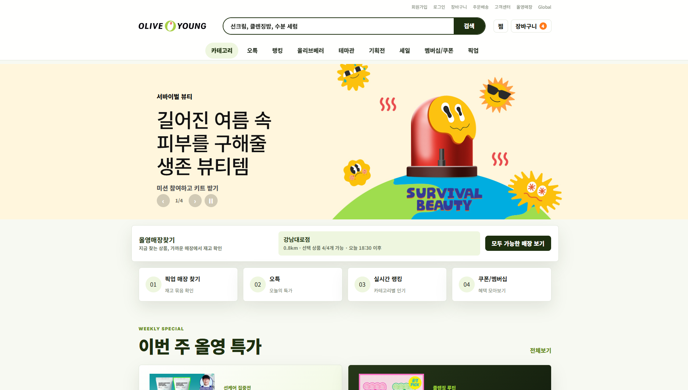

# OLIVE YOUNG Renewal Prototype

위 이미지는 기능 보완 전 캡처입니다. 기존 브랜드 분위기와 섹션 구성을 유지하면서 상품 탐색·선택·픽업 매장 확인을 연결했습니다. 화면의 반복 안내는 줄이고, 서비스 범위는 푸터와 아래 설명에 정리했습니다.

올리브영 온라인몰의 메인 화면 구조를 참고해 제작한 포트폴리오용 리뉴얼 프로토타입입니다. 기존 커머스 홈 화면의 정보 밀도와 픽업 주문 흐름을 개선하는 방향으로, 상품 탐색부터 매장 재고 확인까지 한 화면 안에서 더 자연스럽게 이어지도록 구성했습니다.

## 주요 개선 방향

- 기존 홈 화면은 행사 배너와 상품 영역이 길게 이어져 픽업 주문 흐름이 눈에 잘 띄지 않는다고 판단해, 메인 상단에서 가까운 매장 재고와 픽업 가능 여부를 바로 확인할 수 있도록 구조를 재배치했습니다.
- 상품을 하나씩 확인해야 하는 흐름을 줄이기 위해, 장바구니에 담긴 여러 상품을 기준으로 모두 픽업 가능한 매장을 추천하는 영역을 추가했습니다.
- 기존의 배송 방식 중심 탐색보다 사용자가 원하는 수령 방식이 먼저 보이도록, 상품 카드와 매장 카드에 `픽업가능`, `오늘드림`, 거리, 가능 상품 수, 픽업 시간을 함께 표시했습니다.
- 메인 홈의 정보량은 유지하되, 섹션별 목적이 더 잘 보이도록 `오늘의 특가`, `인기 행사`, `추천 상품`, `카테고리 랭킹`, `신상 업데이트`를 구분해 탐색 흐름을 정리했습니다.
- 검색·찜·선택 상품·픽업 매장 확인·데모 쿠폰은 로그인 없이 체험할 수 있습니다. 기존 로그인 모달은 입력이 비활성화된 화면 시안으로 유지하며 실제 인증은 제공하지 않습니다.

## 구현한 기능

- 상품명·카테고리·배지 검색, 카테고리 선택, 픽업가능/오늘드림/세일 필터, 찜한 상품 보기, 결과 없음과 필터 초기화
- 상품 상세 모달, 상품별 매장 재고 표시, 선택 목록에 추가·삭제·수량 변경(상품별 1~20개)
- 선택 상품의 종류뿐 아니라 요청 수량까지 반영한 매장별 재고 충족 계산
- 전체 가능 매장과 일부 가능 대안 구분, 부족한 상품·요청 수량·재고 확인, 모두 가능한 매장 필터
- 조건을 충족하는 매장 선택과 상단 요약 반영. 상품·수량 변경으로 조건을 충족하지 못하면 매장 선택 해제
- 데모 픽업 쿠폰 받기. 상품 합계 3만원 이상이고 전체 상품 픽업 가능한 매장을 선택한 경우 예상 금액에서 3,000원 차감
- 선택 상품·찜·선택 매장·쿠폰의 localStorage 저장, 저장 데이터 검증·실패 안내, 다른 탭의 변경 반영
- 모달 포커스 이동·Tab 제한·ESC 닫기·포커스 복귀·배경 스크롤 잠금
- 배너 연속 클릭 시 이전 전환 취소, 포커스·마우스·비활성 탭에서 자동 전환 중지, 움직임 감소 설정 반영
- 모바일 상품 두 열 배치, 고정 헤더 압축, 상품 카드 정렬과 행사 영역의 빈 행 보완

## 데모 범위

- 매장 거리·재고·수령 시간은 코드 내 예시 데이터이며 위치·매장 API를 호출하지 않습니다. 재고 배지는 이 데모 데이터에서 계산합니다.
- 매장 선택은 실제 예약이 아니며 실제 주문·결제·배송·쿠폰 발급·회원 인증을 제공하지 않습니다.
- 선택 정보는 현재 브라우저에 저장되며 회원별 데이터 분리나 서버 동기화는 제공하지 않습니다. 실제 계정과 개인정보는 입력받거나 저장하지 않습니다.
- 상품과 매장 출력은 HTML 이스케이프를 적용합니다. 브라우저 저장소의 상품 ID·수량·매장 ID는 허용된 데이터만 반영합니다.
- 아이콘은 버전을 고정한 Lucide CDN을 사용하며, 이미지 파일과 기존 경로는 유지했습니다.

## 구성

- `index.html` - 메인 페이지와 상품 상세/매장 선택/로그인 시안 모달
- `styles.css` - 전체 레이아웃, 상품 카드, 배너, 모달 스타일
- `app.js` - 상품 탐색·찜·선택 목록·데모 매장 재고 계산·상태 저장·모달·배너
- `images/` - 배너, 상품, 로고, 프리뷰 이미지

## 사용 기술

- HTML
- CSS
- JavaScript

## 실행 방법

별도 빌드 과정 없이 `index.html` 파일을 브라우저에서 열면 확인할 수 있습니다.

## 참고

본 작업물은 포트폴리오용 UX/UI 리뉴얼 프로토타입입니다. 실제 올리브영 온라인몰 화면과 이미지를 참고했으며, 상업적 서비스가 아닌 개인 작업물 설명 목적의 정적 웹페이지입니다.

픽업 판단 흐름을 개선하는 설계 의도로 제작했으며 사용자 실험을 통한 성과 검증을 수행한 것은 아닙니다. 이번 수정에서는 빌드·자동 테스트를 실행하지 않았습니다.
